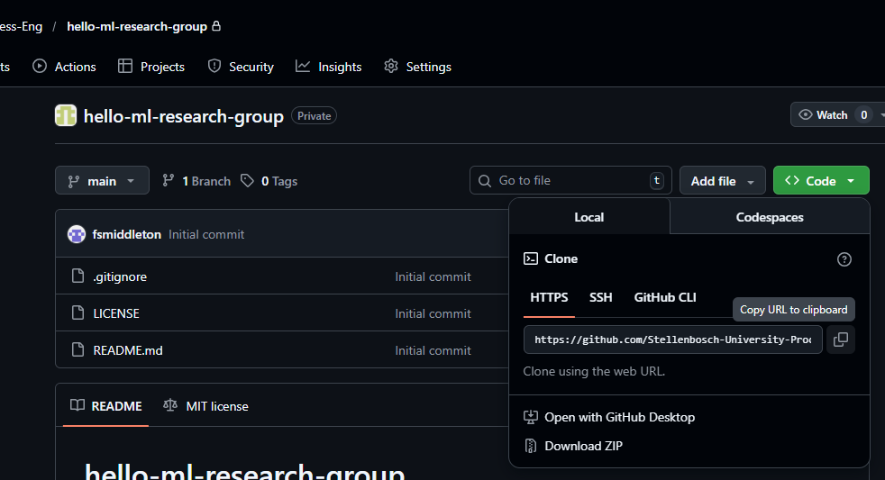
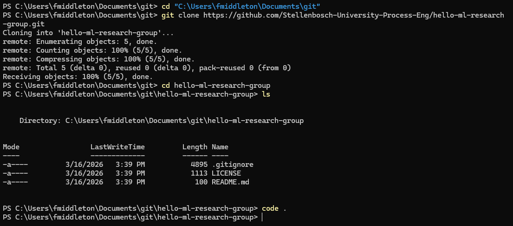
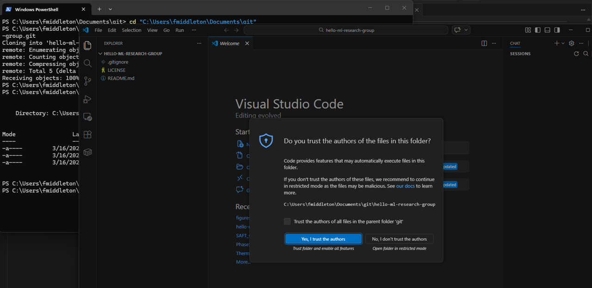
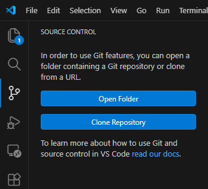
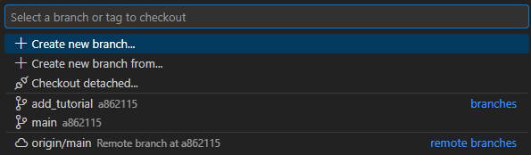
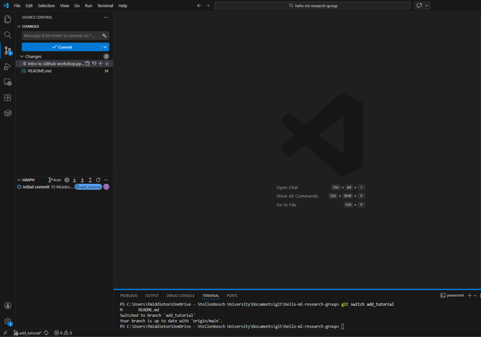
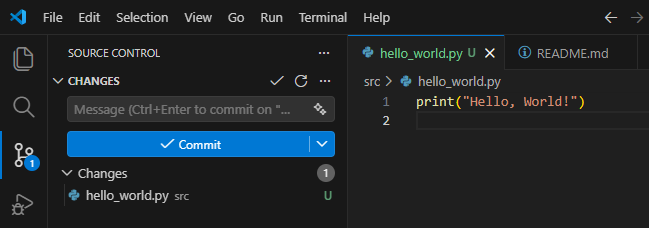
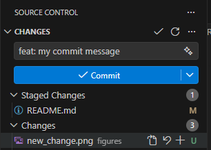
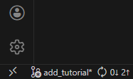

# hello-ml-research-group
A repo for the "hello world" exercise with Github for the research group. This repo is intended to be used as a space to get comfortable with using Github, and includes a tutorial on basic github use, including best practices. This is intended to be followed using the command line or the VS Code GUI, options for both given for all steps. 
***

## Prerequisites
* [Download VS Code](https://code.visualstudio.com/Download)
* [Download Git](https://git-scm.com/install/)
* [Create a GitHub account](https://github.com/)
* Membership in the [Stellenbosch-University-Process-Eng organization](https://github.com/Stellenbosch-University-Process-Eng).
* Log into your Github account on VSCode, on the left hand side on the bottom of the screen of VSCode, person looking icon.
* Configure your git identity in the command line (Powershell on Windows or Linux on Mac):
    ```bash
    git config --global user.name "Your Name"
    git config --global user.email "your.email@example.com"
    ```
You can do this in VSCode itself by opening a terminal using ``Ctrl + Shift + ` ``

***

## Find your organization and locate a repository

1.  Sign in to [Stellenbosch-University-Process-Eng organization](https://github.com) in your browser. Click your profile and switch to the [Stellenbosch-University-Process-Eng organization](https://github.com/Stellenbosch-University-Process-Eng).
2.  Open the [repository](https://github.com/Stellenbosch-University-Process-Eng/hello-ml-research-group.git).
3.  Open the repository's main page and locate the green Code dropdown, this is where you'll copy the repository URL for cloning.



***

## Clone the repository via HTTPS 
### Terminal 

```bash
# Choose a parent directory eg.
cd "<location you want to clone to>"
# Clone the repo in that directory 
git clone https://github.com/<ORG>/<REPO>.git
# navigate to the repo 
cd <REPO>
# open the repo in VS code 
code .
```
The commands in the terminal

VS code opening from the terminal command `code .`


### VS Code GUI

*   Open VS Code → **Source Control** view → **Clone Repository** → paste the **HTTPS URL** → choose a local folder → **Open** when prompted. 



VS Code will detect Git and offer the full Source Control workflow.

***

## Create a topic branch for your change
*  Branches are places where we will make code changes that our main branch can "pull" in with a "Pull Request".
### Terminal 
```bash
git switch -c <my_branch_name>
```

*   `git switch -c` both creates (-c) and checks out (switch) the branch. The newer `switch` command focuses solely on branch operations, reducing the ambiguity of the older, multi-purpose `checkout`. 
* [What is the difference between git switch and checkout?](https://stackoverflow.com/questions/57265785/whats-the-difference-between-git-switch-and-git-checkout-branch)
### VSCode GUI 
Use the **branch name** in the Status Bar → Create New Branch → provide `<my_branch_name>`. The editor will switch you to the new branch.

After using the terminal or GUI, your window will look something like this:

***

## Make a minimal feature change 
Create a file called "hello_world.py" and place the code `print("Hello, World!")` in the file. Save the file. It should now appear on your source control list. 

***

## Stage and commit your changes
*   A commit records a snapshot of the staged content and links it into the repository's history DAG. 
* You **cannot** leave out the **commit message**, or the commit will not work.
*   Commit message guidance: Use an imperative, concise subject and (when needed) a body explaining intent. Chris Beams' “Seven Rules” are widely cited for clarity and consistency. [\[cbea.ms\]](https://cbea.ms/git-commit/)


### Terminal
Stage and commit the feature change, or all changes, and push changes to the remote branch.

```bash
# Stage the change (specific file)
git add src/hellow_world.py
# Stage all changes 
git add . 
# Commit the change 
git commit -m "feat: add hello world file"
# Push your commit to remote  
git push -u origin <my_branch_name>
```


### VSCode GUI
VS Code GUI mirrors the command-line operations.
* Stage specific files in Source Control, using the “+” icons. Or stage all of them using the “+” icon next to "Changes"
* Type your commit message, and press Commit. 
* Refresh the branch by allowing all pulls and pushes to happen that have been fetched from the remote. This should only be used if you know you will have no merge conflicts.




***


## Open a Pull Request on GitHub.com
A pull request is a proposal to merge changes from your branch into a target branch (commonly `main`). It provides a structured space for review, discussion, checks, and, eventually, integration. [\[docs.github.com\]](https://docs.github.com/en/pull-requests/collaborating-with-pull-requests/proposing-changes-to-your-work-with-pull-requests/about-pull-requests)

1.  Navigate to your repository on GitHub. You will typically see a prompt: “Compare & pull request” for your newly pushed branch.
2.  Click it and fill out:
    *   Title: short imperative summary, e.g., “Add `hello_world`”.
    *   Description: context, rationale, and any risks.
3.  Submit the PR.


***

## Assign a colleague, get a review, and merge after approval

*   In the PR sidebar, **request reviewers** and/or assign the PR to a specific colleague.
*   If your repository uses **required reviews** (via protected branches or rulesets), the PR must receive the specified number of approvals before merging. [\[docs.github.com\]](https://docs.github.com/en/pull-requests/collaborating-with-pull-requests/reviewing-changes-in-pull-requests/approving-a-pull-request-with-required-reviews), [\[docs.github.com\]](https://docs.github.com/articles/enabling-required-reviews-for-pull-requests)
*   When checks pass and reviews approve, choose a merge strategy:
    *   **Merge commit** (retains all commits, creates a merge commit).
    *   **Squash and merge** (combines commits into one for a cleaner history).
    *   **Rebase and merge** (replays commits atop the base, producing a linear history).  
        GitHub documents when each strategy is appropriate and how it appears in history. [\[docs.github.com\]](https://docs.github.com/pull-requests/collaborating-with-pull-requests/incorporating-changes-from-a-pull-request/about-pull-request-merges)

Finally, click **Merge** (or enable **Auto-merge** when allowed). After merging, it's common to delete the now-merged topic branch on the server; GitHub can do this automatically if configured. [\[docs.github.com\]](https://docs.github.com/en/pull-requests/collaborating-with-pull-requests/incorporating-changes-from-a-pull-request/merging-a-pull-request)

> \[Figure 10: GitHub PR with one approving review, checks passing, and the green “Merge pull request” button visible]

***

## Where each command “fits” in code management

| Action              | Command(s)                       | What it means in the broader framework                                                                                                                                                                                                                                                                     |
| ------------------- | -------------------------------- | ---------------------------------------------------------------------------------------------------------------------------------------------------------------------------------------------------------------------------------------------------------------------------------------------------------- |
| Clone repository    | `git clone https://…`            | Creates a full local mirror of the project's history so you can develop and contribute. [\[docs.github.com\]](https://docs.github.com/en/repositories/creating-and-managing-repositories/cloning-a-repository)                                                                    |
| Create topic branch | `git switch -c feature/...`      | Starts an isolated line of development aligned with **GitHub Flow**: branch → commit → PR → merge. [\[git-scm.com\]](https://git-scm.com/docs/git-switch), [\[docs.github.com\]](https://docs.github.com/en/get-started/using-github/github-flow)                              |
| Stage/commit        | `git add` / `git commit -m "…" ` | Records a snapshot of your staged changes with an explanatory message, your atomic unit of history and review. [\[git-scm.com\]](https://git-scm.com/docs/gitglossary), [\[git-scm.com\]](https://git-scm.com/book/en/v2/Getting-Started-What-is-Git%3F)                     |
| Push branch         | `git push -u origin feature/...` | Publishes your branch to the remote so collaborators and CI can see it; sets tracking for future sync. [\[docs.github.com\]](https://docs.github.com/en/get-started/git-basics/managing-remote-repositories)                                                                      |
| Open PR             | (on GitHub.com)                  | A structured request to **merge** changes from your branch into the base branch, with review and checks. [\[docs.github.com\]](https://docs.github.com/en/pull-requests/collaborating-with-pull-requests/proposing-changes-to-your-work-with-pull-requests/about-pull-requests)  |
| Review/approve      | (on GitHub.com)                  | Enforces quality gates, discussion, code review, and required approvals per repository policy. [\[docs.github.com\]](https://docs.github.com/en/pull-requests/collaborating-with-pull-requests/reviewing-changes-in-pull-requests/approving-a-pull-request-with-required-reviews) |
| Merge               | (on GitHub.com)                  | Integrates the approved work; choice of merge strategy affects history shape and traceability. [\[docs.github.com\]](https://docs.github.com/pull-requests/collaborating-with-pull-requests/incorporating-changes-from-a-pull-request/about-pull-request-merges)                 |

***

## Best practices for PRs (concise checklist)

*   Keep PRs **small, cohesive, and reviewable**; prefer a few focused commits. [\[docs.github.com\]](https://docs.github.com/en/get-started/using-github/github-flow)
*   Use a **clear title** and a description that states **what** and **why**; link issues
*   Provide or update **tests** and relevant docs in the same PR.
*   Follow repository standards: **PR templates, CODEOWNERS, protected branches, rulesets**. [\[docs.github.com\]](https://docs.github.com/en/pull-requests/collaborating-with-pull-requests/getting-started/managing-and-standardizing-pull-requests)
*   Write **good commit messages** (imperative subject, optional wrapped body explaining rationale). [\[cbea.ms\]](https://cbea.ms/git-commit/)

***

## A compact Git glossary (with quick historical notes)

*   **Commit**: A node in the project history that records a **snapshot** of the tree and metadata (author, message, parents). Not merely a diff in concept. [\[git-scm.com\]](https://git-scm.com/docs/gitglossary), [\[git-scm.com\]](https://git-scm.com/book/en/v2/Getting-Started-What-is-Git%3F)
*   **Branch**: A **reference** (pointer) to a commit, the “tip” of a line of development. Lightweight by design. [\[git-scm.com\]](https://git-scm.com/docs/gitglossary), [\[git-scm.com\]](https://git-scm.com/book/en/v2/Git-Branching-Branches-in-a-Nutshell)
*   **Switch vs. Checkout**: Historically, `checkout` did both “switch branch” and “restore files.” Git 2.23 split that intent: `git switch` (branches) and `git restore` (files), to reduce ambiguity. [\[git-scm.com\]](https://git-scm.com/docs/git-switch), [\[stackoverflow.com\]](https://stackoverflow.com/questions/57265785/whats-the-difference-between-git-switch-and-git-checkout-branch)
*   **Pull Request (PR)**: On GitHub, a request to merge changes from one branch to another with review and checks. The name reflects Git's **distributed** roots: originally, contributors would ask a maintainer to **pull** their branch (e.g., by emailing a `git request-pull` summary). Git still exposes the `git request-pull` command, and the Linux kernel's maintainer flow uses signed pull requests, hence the term's lineage. [\[git-scm.com\]](https://git-scm.com/docs/git-request-pull), [\[docs.kernel.org\]](https://docs.kernel.org/maintainer/pull-requests.html)

### Why “pull” and why “request”?

*   **Pull** (verb) predates computing, “to draw toward oneself”, appropriately describing the maintainer pulling your branch into the mainline. [\[etymonline.com\]](https://www.etymonline.com/word/pull)
*   **Request** traces to Latin *requirere* “to seek, ask for,” i.e., you are asking maintainers to accept and integrate your work. [\[etymonline.com\]](https://www.etymonline.com/word/request)
*   Historically, before rich web UIs, the **email-based** workflow involved pushing your branch to a public repo, then emailing a *request to pull* (today mirrored by GitHub's PR UI). [\[git-scm.com\]](https://git-scm.com/docs/git-request-pull), [\[docs.kernel.org\]](https://docs.kernel.org/maintainer/pull-requests.html)
    *   For deeper narrative histories of the PR concept and its evolution from the Linux kernel and early Git days to modern platforms, see curated retrospectives by practitioners. [\[rdnlsmith.com\]](https://rdnlsmith.com/posts/2023/004/pull-request-origins/), [\[felipec.wo...dpress.com\]](https://felipec.wordpress.com/2025/07/21/pull-request-etymology/)

***

## Full end-to-end example: recap of the commands

```bash
# 1. Clone via HTTPS
git clone https://github.com/ORG/REPO.git
cd REPO

# 2. Create a topic branch
git switch -c feature/greeting-message

# 3. Make your change (edit files)

# 4. Commit feature change
git add src/greeter.py
git commit -m "feat(greeter): add greet(name) that returns a formatted hello"

# 5. Commit test
git add tests/test_greeter.py
git commit -m "test(greeter): add unit test for greet(name)"

# 6. Publish branch
git push -u origin feature/greeting-message

# 7. Open a PR on GitHub.com, request review, and merge after approval
# (GUI steps on GitHub as described above)
```

***

## Troubleshooting and tips

*   **Can't push?** Ensure you have permissions to the organization repo and that your remote (`origin`) points to the correct URL. `git remote -v` and `git remote set-url origin …` help verify/correct remotes. [\[docs.github.com\]](https://docs.github.com/en/get-started/git-basics/managing-remote-repositories)
*   **PR not mergeable?** Check for required reviews, status checks, and branch protection rules. [\[docs.github.com\]](https://docs.github.com/en/pull-requests/collaborating-with-pull-requests/reviewing-changes-in-pull-requests/approving-a-pull-request-with-required-reviews), [\[docs.github.com\]](https://docs.github.com/articles/enabling-required-reviews-for-pull-requests)
*   **Unsure which merge strategy to select?** Review GitHub's documentation on merge, squash, and rebase merges and choose the policy your team recommends. [\[docs.github.com\]](https://docs.github.com/pull-requests/collaborating-with-pull-requests/incorporating-changes-from-a-pull-request/about-pull-request-merges)

***

